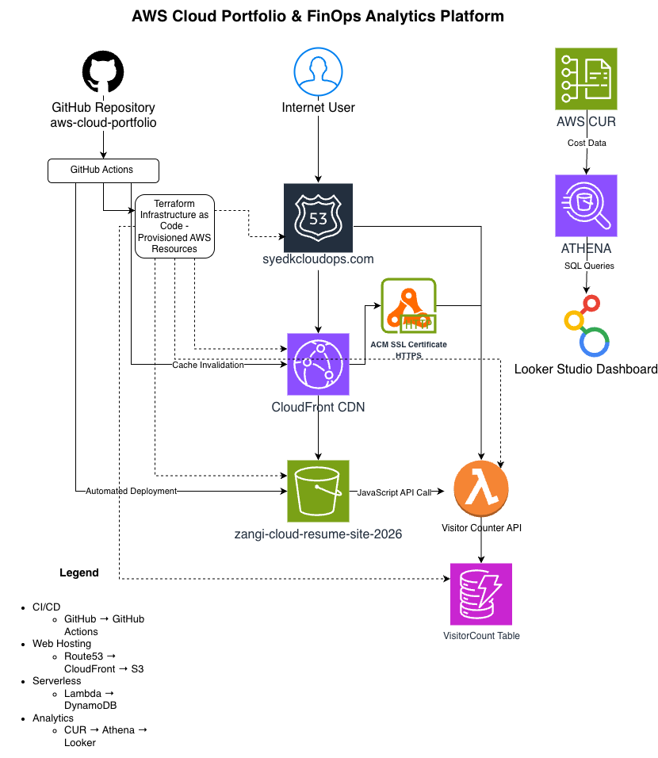
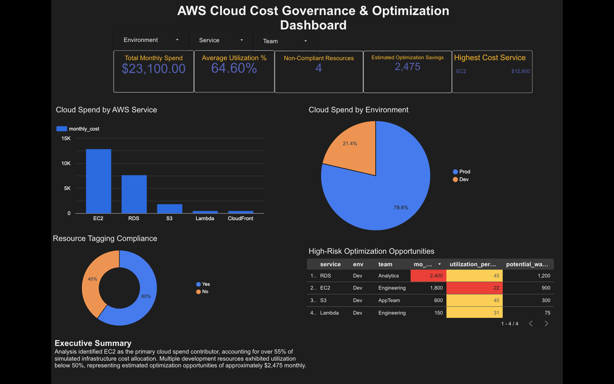
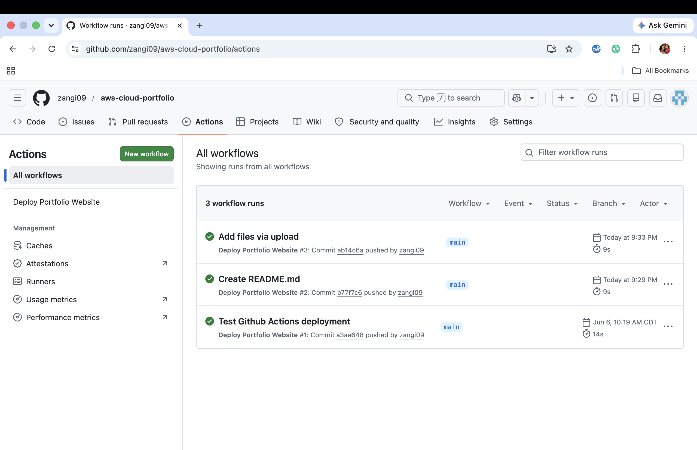
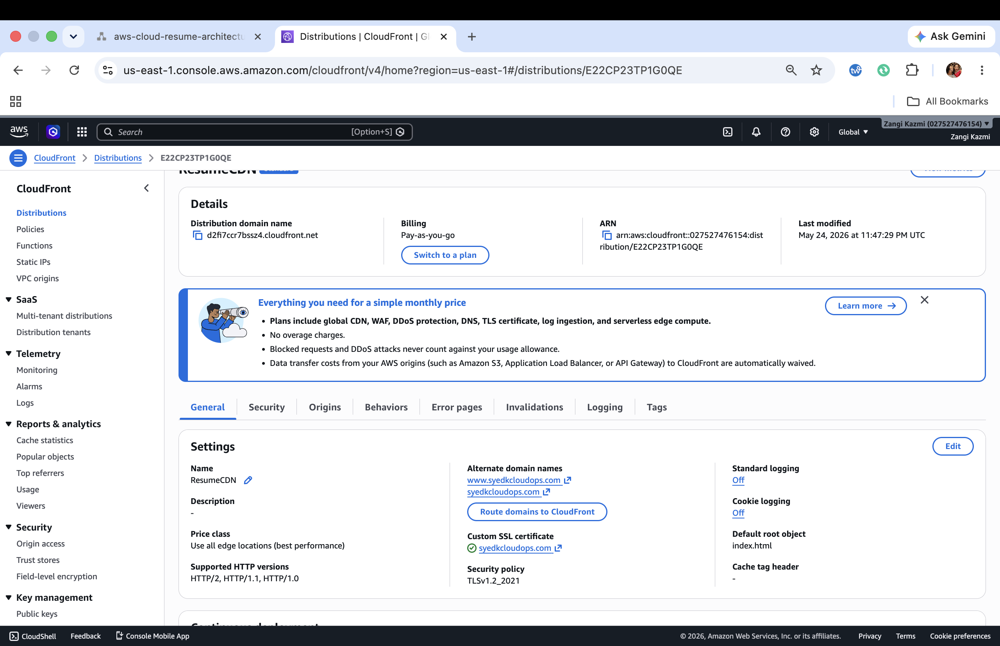
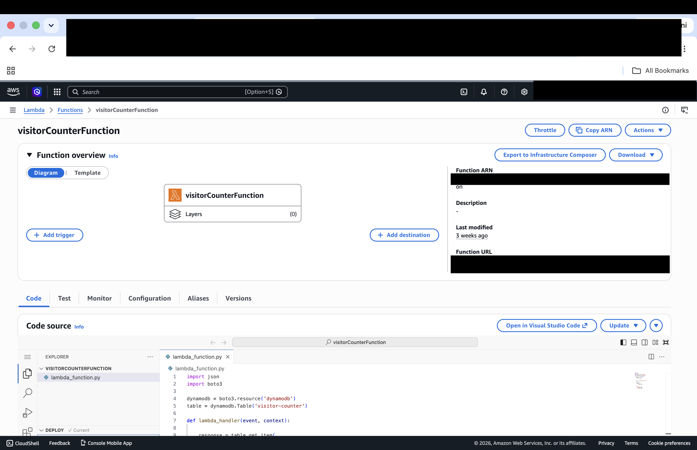

# AWS Cloud Portfolio & FinOps Analytics Platform

A production-inspired cloud project demonstrating Infrastructure as Code (Terraform), serverless architecture, CI/CD automation, custom domain management, and FinOps analytics using AWS native services.

---

## Project Overview

This project extends the AWS Cloud Resume Challenge into a cloud infrastructure and cost optimization platform.

Features include:

- Static portfolio website hosted on Amazon S3
- Global content delivery through Amazon CloudFront
- Custom domain with Route 53 and HTTPS using AWS Certificate Manager
- Serverless visitor counter powered by AWS Lambda and DynamoDB
- Infrastructure provisioned with Terraform
- Automated deployments using GitHub Actions
- AWS Cost & Usage Report (CUR) analytics with Athena and Looker Studio
- Interactive FinOps dashboard highlighting spend, utilization, and optimization opportunities

---

## Key Achievements

* Designed and deployed a production-inspired AWS cloud platform using Infrastructure as Code (Terraform).
* Automated deployments using GitHub Actions CI/CD pipelines.
* Implemented a serverless visitor tracking solution using AWS Lambda and DynamoDB.
* Configured Route53, CloudFront, and ACM for secure custom domain hosting.
* Developed a FinOps analytics dashboard using AWS Cost and Usage Reports, Athena, and Looker Studio.
* Diagnosed and resolved real-world cloud infrastructure issues involving DNS validation, SSL certificates, CI/CD authentication, and API integrations.

---

## Project Metrics

| Metric                      | Value                   |
| --------------------------- | ----------------------- |
| Cloud Provider              | AWS                     |
| Infrastructure Provisioning | Terraform               |
| CI/CD Platform              | GitHub Actions          |
| CDN                         | Amazon CloudFront       |
| DNS                         | Amazon Route 53         |
| Serverless Compute          | AWS Lambda              |
| Database                    | DynamoDB                |
| Analytics Platform          | Athena + Looker Studio  |
| Custom Domain               | syedkcloudops.com       |
| SSL/TLS                     | AWS Certificate Manager |

---

## Architecture



---

## Live Website

Deployed through CI/CD

**Portfolio:** https://syedkcloudops.com

---

## Screenshots

### Architecture Diagram

This diagram illustrates the complete cloud architecture including DNS, CDN, serverless components, Infrastructure as Code (IaC), CI/CD automation, and FinOps analytics.


---

### FinOps Analytics Dashboard

Interactive dashboard built using AWS Cost and Usage Reports (CUR), Amazon Athena, and Looker Studio to visualize cloud spend, optimization opportunities, and resource utilization.



### CI/CD Pipeline

Automated deployment pipeline using GitHub Actions. Every code change pushed to the main branch automatically deploys the website to Amazon S3 and invalidates the CloudFront cache.



### CloudFront Distribution

Global content delivery and HTTPS-enabled website distribution using Amazon CloudFront and AWS Certificate Manager.



### Serverless Visitor Counter

AWS Lambda and DynamoDB power a serverless visitor counter that tracks and displays website visits in real time.



---

## Technology Stack

| Category | Technologies |
|-----------|--------------|
| Cloud | AWS |
| IaC | Terraform |
| DNS | Route 53 |
| CDN | CloudFront |
| Storage | Amazon S3 |
| Compute | AWS Lambda |
| Database | DynamoDB |
| Security | AWS Certificate Manager (ACM) |
| CI/CD | GitHub Actions |
| Analytics | AWS CUR, Athena, Looker Studio |
| Version Control | Git & GitHub |

---

## Infrastructure Components

### Static Website

- Amazon S3 hosts portfolio assets
- CloudFront distributes content globally
- Route 53 manages DNS
- ACM provides HTTPS certificates

### Visitor Counter API

- JavaScript calls Lambda Function URL
- Lambda updates DynamoDB visitor count
- Count displayed dynamically on homepage

### Infrastructure as Code

Terraform provisions:

- S3 Bucket
- CloudFront Distribution
- Route 53 Records
- Lambda Function
- DynamoDB Table
- IAM Resources

### CI/CD Pipeline

GitHub Actions automatically:

- Deploys website updates to S3
- Invalidates CloudFront cache
- Publishes changes without manual intervention

---

## Monitoring & Incident Response

- Implemented Amazon CloudWatch dashboards to monitor Lambda visitor-counter metrics and CloudFront website delivery metrics.
- Configured Terraform-managed CloudWatch alarms for Lambda errors and CloudFront 5XX error rates.
- Integrated Amazon SNS email notifications for proactive alerting.
- Validated monitoring resources through AWS Console review, Terraform apply output, and live site traffic testing.
- Troubleshot and resolved a Terraform nested resource error in `monitoring.tf` by correctly closing the CloudWatch alarm block before declaring the dashboard resource.
- Documented incident response steps for website availability, Lambda errors, CloudFront errors, deployment failures, and cost threshold alerts.

---

## FinOps Dashboard

The project includes an AWS cost optimization dashboard built from Cost & Usage Reports.

### KPIs

- Total Monthly Spend
- Average Utilization
- Non-Compliant Resources
- Estimated Optimization Savings
- Highest Cost Service

### Visualizations

- Spend by AWS Service
- Spend by Environment
- Tagging Compliance
- High-Risk Optimization Opportunities

---

## Repository Structure

```
.
├── images/
│   ├── architecture-diagram.png
│   ├── dashboard.png
│   ├── github-actions.png
│   ├── cloudfront.png
│   └── lambda-counter.png
├── index.html
├── styles.css
├── script.js
├── terraform/
├── lambda/
├── .github/
│   └── workflows/
│       └── deploy.yml
└── README.md
```

---

## CI/CD Workflow

```
Developer
      │
      ▼
Git Push
      │
      ▼
GitHub Repository
      │
      ▼
GitHub Actions
      │
      ├── Sync website to S3
      └── Invalidate CloudFront Cache
```

---

## Monitoring & Incident Response

* Built Amazon CloudWatch dashboards for Lambda and CloudFront operational metrics.
* Configured alarms for Lambda failures, CloudFront 5XX errors, and website availability.
* Implemented SNS email notifications for proactive incident detection.
* Added synthetic availability monitoring for `syedkcloudops.com`.
* Created an incident-response runbook covering investigation, rollback, and service recovery.
* Validated monitoring and recovery procedures through controlled testing.

For detailed response procedures, see the [Incident Response Runbook](docs/incident-response-runbook.md).

---

## Operational Experience Gained

This project provided hands-on experience across multiple cloud engineering disciplines:

* Infrastructure as Code deployment and resource management using Terraform.
* DNS administration and domain delegation using Route 53.
* SSL certificate validation and HTTPS configuration using AWS Certificate Manager.
* Serverless application development using AWS Lambda and DynamoDB.
* CI/CD automation through GitHub Actions.
* Cloud cost visibility and optimization using AWS Cost & Usage Reports, Athena, and Looker Studio.
* Root cause analysis and troubleshooting of production-style issues involving DNS, API communication, CI/CD authentication, and infrastructure configuration.
* * Resolved Terraform monitoring configuration errors while adding CloudWatch dashboards and alarms through Infrastructure as Code.

---

## Troubleshooting & Lessons Learned

### ACM Certificate Validation

- Diagnosed delayed certificate issuance
- Verified Route 53 DNS validation records
- Corrected NS/SOA configuration issues
- Successfully validated root and `www` domains

### GitHub Actions

- Resolved Personal Access Token permission errors
- Updated PAT with `workflow` scope
- Validated automated deployment pipeline

### Lambda API

- Investigated browser CORS failures
- Removed duplicate `Access-Control-Allow-Origin` headers
- Verified successful client-side API communication

### Route 53

- Troubleshot hosted zone configuration
- Verified domain delegation and nameserver assignments
- Restored proper DNS resolution

### Terraform Monitoring Resource Error

While adding CloudWatch monitoring through Terraform, I encountered a `Blocks of type "resource" are not expected here` error. The issue was caused by accidentally placing the CloudWatch dashboard resource inside the CloudFront alarm resource block. I resolved it by closing the alarm block before declaring the dashboard resource, then reran `terraform fmt`, `terraform validate`, and `terraform apply` successfully.

### CloudFront

- Implemented cache invalidation during deployments
- Verified updated content propagation globally
- After applying Terraform changes, the custom domain temporarily returned a CloudFront 403 error. The issue was caused by CloudFront alias and ACM certificate settings needing to be codified in Terraform instead of only configured manually in the AWS Console. I resolved it by adding both `syedkcloudops.com` and `www.syedkcloudops.com` as CloudFront aliases and attaching an ACM certificate that covered both domains. HTTPS was verified successfully in incognito mode after browser cache caused a stale security warning.

### Terraform Monitoring

- Resolved Terraform nested resource error in `monitoring.tf` where the CloudWatch dashboard resource was accidentally placed inside the CloudFront alarm resource.
- Fixed the issue by closing the alarm block before declaring the dashboard resource.
- Validated the configuration with `terraform fmt` and `terraform validate`.
- Applied the monitoring update successfully, adding Terraform-managed CloudWatch monitoring resources.

### FinOps Dashboard

- Created Athena SQL queries against AWS CUR
- Built interactive Looker Studio dashboard
- Added filters, KPI cards, and conditional formatting
- Identified underutilized resources and potential savings

---

## Key Skills Demonstrated

- AWS Cloud Architecture
- Terraform Infrastructure as Code
- Serverless Computing
- DNS & CDN Configuration
- CI/CD Automation
- GitHub Actions
- Cloud Cost Optimization (FinOps)
- Athena SQL
- Dashboard Development
- Troubleshooting & Root Cause Analysis

---

## Future Enhancements

- Add AWS WAF protection
- Integrate CloudWatch alarms
- Implement SNS notifications
- Add Terraform remote state management
- Deploy through CodePipeline
- Build multi-environment infrastructure (Dev/Prod)
- Add automated cost anomaly detection

---

## Author

**Syed Kazmi**

Cloud Operations | FinOps | Infrastructure Automation
